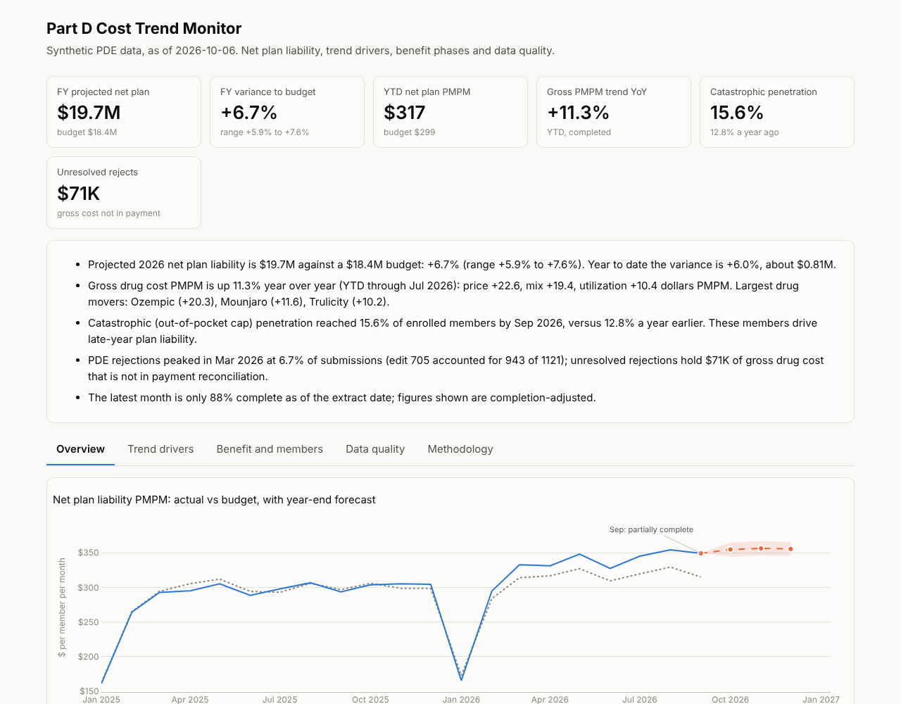
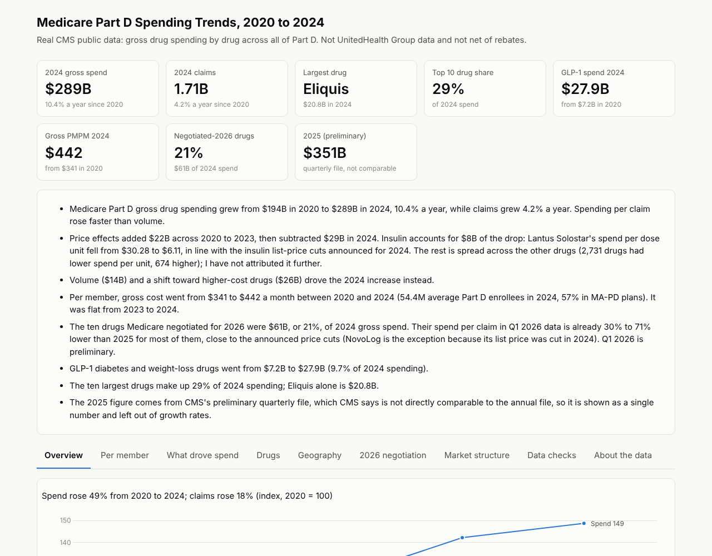

# Medicare Part D Cost Trend Analysis
This repository contains a Medicare Part D cost trend analysis: a pharmacy claims (PDE) pipeline, per-member-per-month (PMPM) and trend measurement, a forecast against budget, dashboards, and automated tests supporting the reported figures.

**Deliverables.** Two dashboards are maintained separately because they rest on different data.
- `reports/partd_dashboard.html`: plan-level analysis on **synthetic** claims (PDE, PMPM, IBNR, budget, forecast). No data from any employer or real plan is used, and benefit parameters are illustrative; they should be verified against the CMS Rate Announcement before any production use.
- `reports/partd_public_cms_dashboard.html`: analysis of **public CMS data** (data.cms.gov): spending by drug 2020 to 2024, monthly enrollment (member months, enabling PMPM), state-level cost, and 2026 Medicare negotiated prices. Figures are national, gross of rebates. Run `make public` to download and build it.
- `reports/partd_analyst_pack.xlsx`: the public-data analysis as an Excel workbook with live formulas (`make excel`). `docs/BRIEFING.md`: a one-page briefing memo (`make briefing`).




## Business question

> Is net plan liability running above or below budget, what is driving the variance, and where is the year expected to finish?

Results on the bundled synthetic book (6,000 members, 498K claims, January 2024 to September 2026):

- Projected 2026 net plan liability is **$19.7M against a budget of $18.4M (+6.7%; scenario range +5.9% to +7.6%)**.
- Gross PMPM is up **11.3% year over year**: price +$22.6, mix +$19.4, utilization +$10.4, with GLP-1 brands the largest contributor.
- Catastrophic-phase penetration is **15.6%** of members, compared with 12.8% a year earlier.
- PDE rejections reached **6.7% in March 2026** (edit 705), leaving **$71K** of gross cost unresolved.

Results on public CMS data are summarized in `docs/BRIEFING.md`.

## Scope

| Area | Content | Location |
|---|---|---|
| Data | Synthetic PDE stream including adjustments, deletions, rejections, resubmissions and late arrivals; 2024 legacy and 2025+ IRA benefit designs | `src/partd/generate.py`, `benefit.py` |
| Warehouse | DuckDB and dbt: staging, PDE final action, benefit-phase re-derivation, 14 marts, 13 singular tests | `dbt_project/` |
| Actuarial | Completion factors and IBNR, PMPM, budget variance, price/volume/mix decomposition | `mart_pmpm_completed`, `mart_trend_drivers` |
| Forecast | Rolling-origin backtest, method selected on backtest error, empirical interval, full-year projection against budget | `src/partd/forecast.py` |
| Public data | CMS spending, enrollment, state and negotiated-price analysis; national PMPM; cross-file reconciliation | `src/partd/public_cms.py`, `public_extra.py` |
| Analyst deliverables | Excel workbook, briefing memo, quarterly runbook, data-quality log, SQL and SAS | `reports/`, `docs/`, `sql/public/`, `sas/` |
| Reporting | HTML dashboards, Streamlit app, Power BI build kit (DAX, theme, model guide) | `reports/`, `app/`, `powerbi/` |
| Testing | 86 dbt checks and 40 pytest tests | `dbt_project/tests`, `tests/` |

## Reproduction

```bash
pip install -r requirements.txt
make all                 # generate, load, dbt build, forecast, report, export, test
open reports/partd_dashboard.html
make app                 # interactive Streamlit version
```

`PARTD_MEMBERS=800 make all` produces a reduced build in under a minute and is what CI runs.

## Quality controls

- **Payment identity** on every claim: gross cost equals patient pay plus LICS plus plan paid plus manufacturer discount, to the cent.
- **Independent re-derivation** of each claim's benefit phase from cumulative cost, with tests on deductible, out-of-pocket cap and catastrophic cost sharing.
- **Negative testing:** the data was deliberately corrupted in several ways to confirm the tests detect each case.
- **Exact decomposition:** utilization, mix and price effects sum to the PMPM change, enforced by a test.
- **Forecast selection** based on rolling-origin error relative to a naive baseline.

## Limitations

- Plan-level data, benefit parameters and budget are synthetic.
- The benefit design is simplified: the deductible applies to all tiers, adjustments are generated only on plan-only claims, and the completion factor is gross-based and applied uniformly.
- The backtest has nine forecasts, so method selection and the interval are provisional. The selected method under-forecast in every period (bias +2.0%), so the full-year projection is more likely understated than overstated.
- Benefit-phase re-derivation is valid only where a member's claim history is complete; tests are scoped accordingly.
- 2027 is not modeled.
- Public CMS data exclude rebates, so all figures are gross; net cost to a plan cannot be derived from them. Per-member figures use CMS's separate enrollment file as the denominator. 2025 data come from a preliminary quarterly file and are not compared with the annual series. Injectable dose-unit prices (insulin, GLP-1) are only partly reliable.
- SAS programs are reference translations and have not been executed. No `.pbix` file is included; `powerbi/model.md` documents the build, and the DAX has not been tested in Power BI Desktop.

## Documentation

`docs/ARCHITECTURE.md`, `METRICS.md`, `ASSUMPTIONS.md`, `DATA_QUALITY.md`, `RUNBOOK.md`, `BRIEFING.md`.
