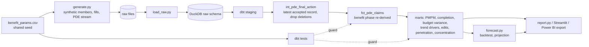

# Architecture

## Design decisions

1. **Single source of truth for benefit design.** `benefit_params.csv` is read by both the Python generator and dbt, so the two cannot drift.
2. **Final action before anything else.** PDE records are a stream of originals, adjustments and deletions. Everything downstream uses only the latest accepted record per claim.
3. **Completion before trend.** Recent months are incomplete. Trend and forecast use completion-adjusted figures; the latest month is flagged.
4. **Regime break.** The 2025 redesign changes the level and shape of liability, so forecasting uses 2025 onward only.
5. **Independent check, not a copy.** dbt re-derives phase from cumulative amounts instead of trusting the generator's labels.
6. **Marts at segment grain** (month x plan type x LIS) so any dashboard can aggregate without re-deriving ratios.
